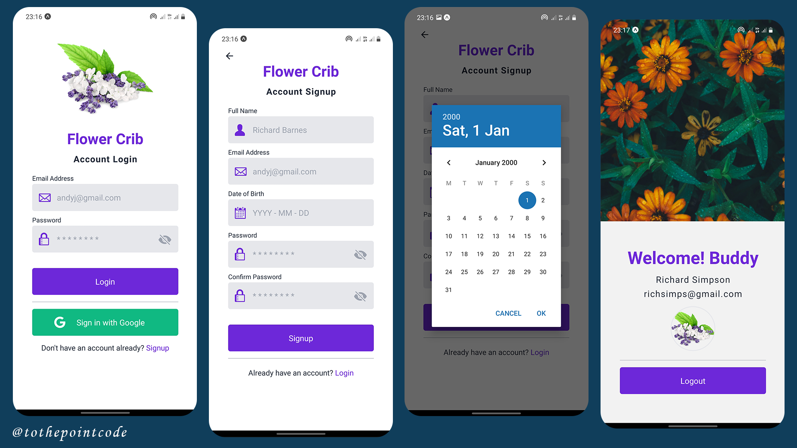

# Flower Crib 
A full frontend login system mobile application which has been connected to a hosted backend application. This was built for a video series on my [YouTube channel](https://www.youtube.com/channel/UCWUk0Y_h1bLvB8qLZ4lAS8A?sub_confirmation=1) .

## Screenshots

## Link To Video Series
[Creating the screens & authentication](https://youtube.com/playlist?list=PLk8gdrb2DmCicLTZJWC2cCTFXloTBMBCt)

## Built With
* [Expo](https://docs.expo.io/)
* [React Native](https://reactnative.dev/)

## Note
Exposed client ids (Part 5 - Google Signin) are no longer valid. So you have to follow the depicted steps to generate yours.

